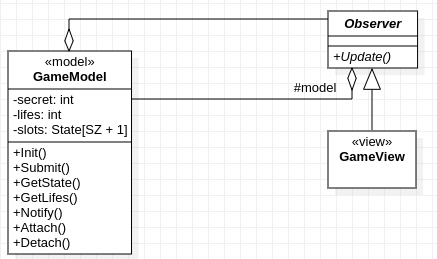
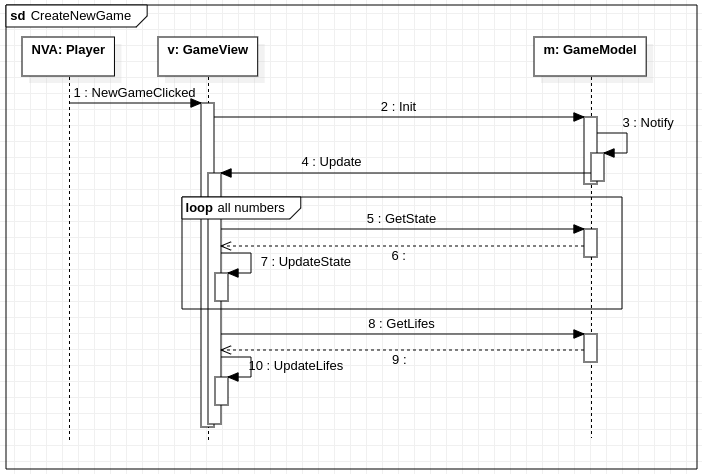
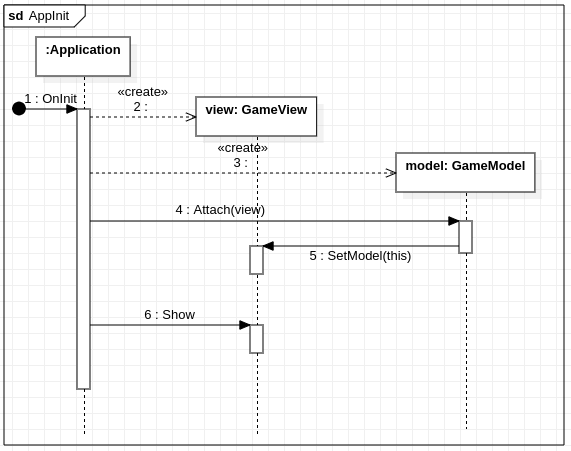

# Kiến trúc Document-View?

Giản lược triển khai MVC với C++, chỉ giữ lại Model và View / Tích hợp View với Controller.

## Các biểu đồ

### Biểu đồ lớp

Quan hệ giữa các thành phần

### Biểu đồ tuần tự

Tạo game mới

Đoán số

Khởi tạo các đối tượng